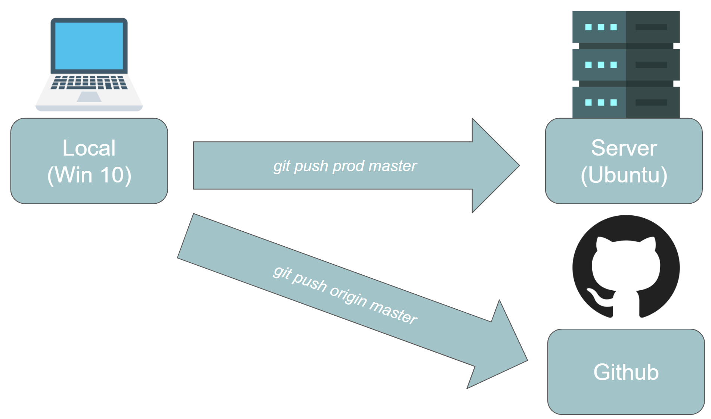
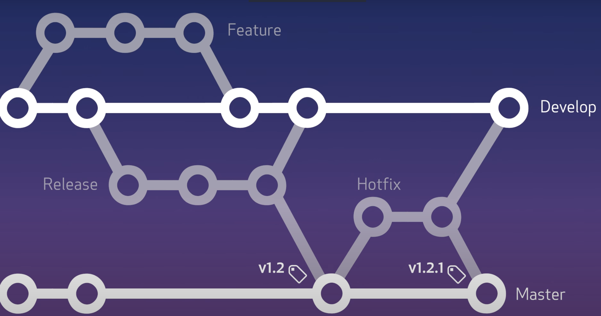

# How to deploy to any server with Git

Power your deployment workflow with git to commit and push changes to any linux instance. Credits to @noelboss for [his great tutorial](https://gist.github.com/noelboss/3fe13927025b89757f8fb12e9066f2fa). Loving it. Though, I encountered some issues. In the `project.git/hooks/post-receive` script, the `GIT_DIR="/home/webuser/www.git"` confused me. It should read `GIT_DIR="/home/webuser/project.git"` to follow the exemplary names from the tutorial. 

To make life easier for future versions of myself that gets pushed into a repository, I write this piece to list all steps that worked for the current master branch of myself. 




## TL;DR

```sh
# -------- SERVER SIDE
# login with putty, then:
$ pwd 
/home/myusername
# create directory for the working copy of the project 
$ mkdir MYPATHNAME/PROJECTNAME
# create directory and init bare repository 
$ mkdir PROJECTNAME.git
$ git init --bare ~/PROJECTNAME.git
cd PROJECTNAME/hooks
nano post-receive

# --------------------------------------
# change TARGET and GIT_DIR according the dir names above
# change BRANCH if you don't work on master
#!/bin/bash
TARGET="/home/myusername/MYPATHNAME/PROJECTNAME"
GIT_DIR="/home/myusername/PROJECTNAME.git"
BRANCH="master"

while read oldrev newrev ref
do
    # only checking out the master (or whatever branch you would like to deploy)
    if [ "$ref" = "refs/heads/$BRANCH" ];
    then
        echo "Ref $ref received. Deploying ${BRANCH} branch to production..."
        git --work-tree=$TARGET --git-dir=$GIT_DIR checkout -f $BRANCH
    else
        echo "Ref $ref received. Doing nothing: only the ${BRANCH} branch may be deployed on this server."
    fi
done
# exit: CTRL+x, y
# --------------------------------------
# add execute permissions to the script
$ chmod +x post-receive

# -------- ON LOCAL MACHINE (WIN 10) 
# open a cmd in your local project repository
# assume valid setup for your server with OpenSSH in %USERPROFILE%/.ssh/id_rsa
> git add remote ANYREMOTENAME myusername@myserveraddress:PROJECTNAME.git
# check git remotes
> git remote -v
origin  https://github.com/philippschmalen/ESG-trending-topics-radar.git (fetch)
origin  https://github.com/philippschmalen/ESG-trending-topics-radar.git (push)
prod    myusername@myserveraddress:PROJECTNAME.git (fetch)
prod    myusername@myserveraddress:PROJECTNAME.git (push)
> git add . 
> git commit -m "first deployment to server. Great work."
> git push prod master


```

## Setting
_You have_

* a git repository on your local machine 
* a server 
* SSH connection to your server 

## Goal
> _You want to_ 

* Use `git` to push any changes to your server _aka_ deploy local changes to your server

## Solution

Setup a github hook for deployment. I followed these resources

1. https://www.youtube.com/watch?v=H6UU7TsyrGs
2. https://gist.github.com/noelboss/3fe13927025b89757f8fb12e9066f2fa

### Post-receive hook

The hook `post-receive` resides in `/home/[username]/[bare-repo-name].git/hooks`. Edit with `nano post-receive` and change _TARGET_ and _GIT\_DIR_. 

* _TARGET_: Your project folder, for example `/home/username/deploy-project`
* _GIT\_DIR_: Bare repository which you created with `git init --bare ~/deploy-github-hook.git`


```bash
#!/bin/bash
TARGET="/home/cloudsigma/deploy-project" # your project folder 
GIT_DIR="/home/cloudsigma/deploy-project-hook.git" # bare repo
BRANCH="master"

while read oldrev newrev ref
do
    # only checking out the master (or whatever branch you would like to deploy)
    if [ "$ref" = "refs/heads/$BRANCH" ];
    then
        echo "Ref $ref received. Deploying ${BRANCH} branch to production..."
        git --work-tree=$TARGET --git-dir=$GIT_DIR checkout -f $BRANCH
    else
        echo "Ref $ref received. Doing nothing: only the ${BRANCH} branch may be deployed on this server."
    fi
done

```


## Git workflow with branches

Follow _best practices from software development_ and center your workflow around branches. 

 
> source: https://www.youtube.com/watch?v=aJnFGMclhU8

Common setup: 

* __master__: Live production, business impact
* __develop__: Common space to introduce new features in parallel to the master branch
* __feature__: Implementing a feature that later gets pushed to _develop_ 
* __release__: part of _develop_ that goes live with the next release
* __hotfix__: Quick bug fixes to the production-relevant _master_, like performing open-heart surgery 

Great resource to get going with feature branch workflows: [atlassian.com/git/tutorials](https://www.atlassian.com/git/tutorials/comparing-workflows/feature-branch-workflow#:~:text=The%20core%20idea%20behind%20the,without%20disturbing%20the%20main%20codebase.). 

## Appendix

### Get a list of git remote 

```bash
git remote -v
```

### Checklist for SSH connection

Tutorial for Win 10: [Use SSh with Putty on Windows](https://devops.ionos.com/tutorials/use-ssh-keys-with-putty-on-windows/)

1. Created a private key with puttygen `[privatekeyname].ppk`
2. Configure the server side following for example [this tutorial](https://bullseyestock.wordpress.com/2018/02/27/setting-up-an-instance-in-cloudsigma/) or [this tutorial from cloudsigma](https://community.cloudsigma.com/hc/en-us/articles/215936063-How-to-generate-OpenSSH-compatible-Keys-for-use-with-PuTTY-and-using-PuTTY-to-access-CloudSigma-s-cloud-using-SSH-)
3. In terminal check logs with SSH verbose
    `ssh -v [server_username]@[host_address]`

    Working example: `ssh -v cloudsigma@99.123.123.123`
